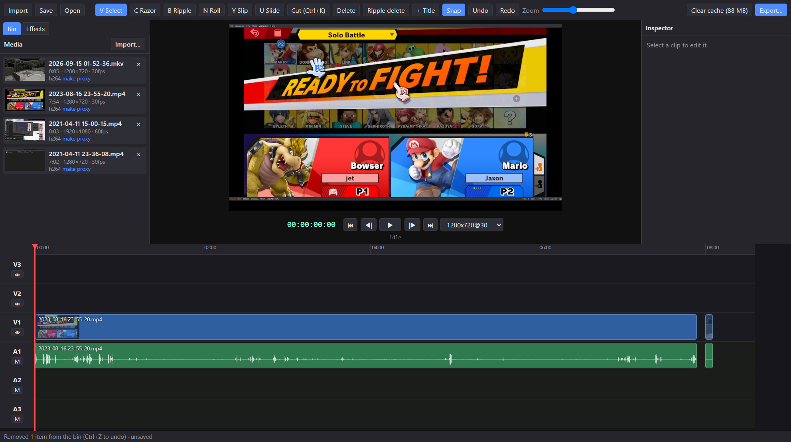

# Open Video Editor 🎬

<p align="center">
  
</p>

A native Windows video editor for cutting down [OBS](https://obsproject.com) screen and game recordings. It's built on Electron, React and TypeScript, and uses [ffmpeg](https://ffmpeg.org) for probing, proxies and export. The preview and the export share the same math for transitions and effects, so the exported MP4 matches what you saw in the app.

It also ships a command-line tool, `ove`, and an MCP server, so an AI assistant like Claude Code can do a rough edit of a recording and open the result in the app for you to review.

## Quickstart 🚀

Requires Windows, Node 18+ and Git.

```
git clone https://github.com/Gidntsquia/open-video-editor
cd open-video-editor
npm.cmd install   # Downloads Electron and a static ffmpeg (~250 MB)
npm.cmd start     # Builds the UI and opens the app
```

Or double-click `run.bat`, which does the same. Import recordings with Ctrl+I or by dragging them in, drag them onto the timeline, and export with Ctrl+M.

IMPORTANT: use `npm.cmd`, not `npm`. PowerShell's default execution policy blocks `npm.ps1`, and `npm.cmd` avoids it without changing the policy.

Other commands:

```
npm.cmd run ove -- help   # The ove CLI: probe, cut and check projects headlessly
npm.cmd run mcp           # The MCP server (Claude Code picks it up from .mcp.json)
npm.cmd test              # Export, CLI, transition and MCP tests (needs ffmpeg on PATH)
```

## Features 🔬

- Imports mp4, mov and mkv in H.264 or HEVC. HEVC, very large and high-bitrate files get a smaller proxy for playback automatically.
- Three video and three audio tracks, with razor, ripple, roll, slip and slide tools and Premiere-style shortcuts.
- The inspector covers volume, fades, volume keyframes, brightness/contrast/saturation, crop, scale, position and speed.
- 14 video transitions (dissolves, dips, wipes, pushes, cross zoom) and 3 audio crossfades.
- Text titles with font, size, colour, position and duration.
- Exports H.264 + AAC MP4. NVENC is used when an NVIDIA GPU is present, otherwise x264, and a budget setting lets the export run in the background at low priority.
- `ove` finds scenes, silences, loud moments and transcripts in a recording, builds a `.ovep` project from a list of commands, and renders frames or a 480p preview to check it.
- The MCP server exposes every `ove` command as a tool and reloads the project in the running app after each edit, with the playhead on the change.
- Thumbnails, waveforms, proxies and temp files go to a 2 GB `cache/` folder with a Clear cache button. Source media is never modified.

## Documentation 📚

More details in the
[wiki](https://github.com/Gidntsquia/open-video-editor/wiki):

- [Editing](https://github.com/Gidntsquia/open-video-editor/wiki/Editing) — shortcuts, bin, transitions, export settings
- [ove CLI](https://github.com/Gidntsquia/open-video-editor/wiki/Ove-CLI) — commands, batches, caching, GPU transcripts
- [MCP Server](https://github.com/Gidntsquia/open-video-editor/wiki/MCP-Server) — Claude Code setup and app control
- [Development](https://github.com/Gidntsquia/open-video-editor/wiki/Development) — cache, tests, install notes, credits

## License 📄

[MIT](LICENSE). The ffmpeg binaries are downloaded by `ffmpeg-static` and `ffprobe-static` at install time and are licensed LGPL/GPL by the FFmpeg authors.
